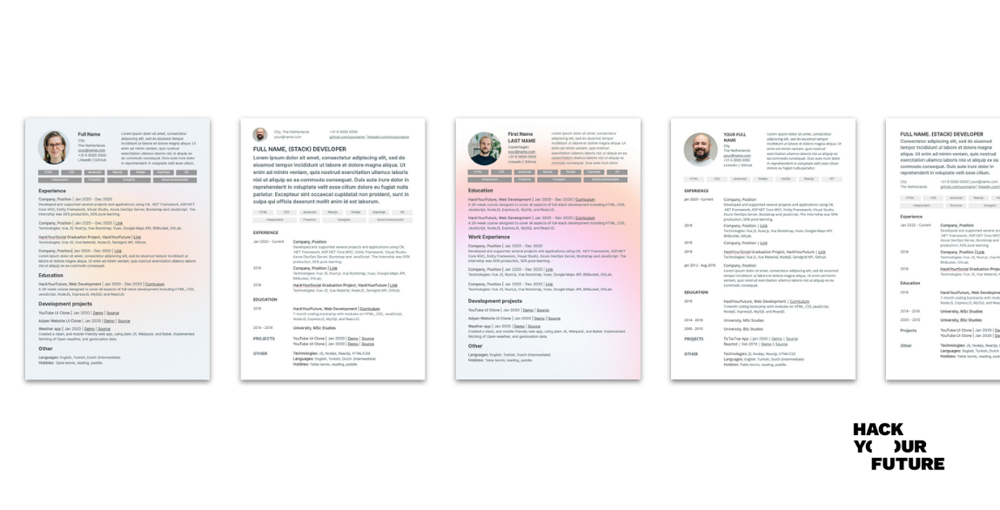

# Your Personal Brand

*This repo is all about preparing you as well as possible for landing your first developer job.* 

**Technical and soft skills are incredibly important to get and keep a job or internship. But before you get one, you will have to get the attention of a company or recruiter, so that they give you an opportunity to interview with them.**

Sometimes, companies contact us and we are able to recommend you directly, but most of the time you will have to compete with the all the other applicants for the job. So for you to be invited for an interview, companies need to be interested in your profile. For that, it is important that you have a professional **personal brand.**

**Your personal brand is usually comprised of:**
- [Your CV or Resume](yourcurriculum.md)
- [Your GitHub Profile](yourgithub.md)
- [Your LinkedIn Profile](yourlinkedin.md)
- Your Online Portfolio (Coming soon!)

In this guide we will explain each of them, how to build your own brand and share with you some online resources to make the job easier.

## Additional reading material

Crafting a good personal brand takes time, effort and self reflection. Here are some of the best articles we’ve found on the WWW to inform you about this subject!

- [10 Soft Skills Every Developer Needs](https://hackernoon.com/10-soft-skills-every-developer-needs-66f0cdcfd3f7)
- [How to Write a Short Professional Bio](https://business.tutsplus.com/tutorials/how-to-write-a-short-bio--cms-30643)
- [Web Developer Resume Examples](https://standardresume.co/examples/web-developer)
- [CV Templates for HYF students](https://docs.google.com/presentation/d/1VGbSrhNKhX3QM7lpbE5Lo_-nbUUXU9Vgpvzy0P_hhEM/copy)
- [Basic writing and formatting syntax for GitHub](https://docs.github.com/en/free-pro-team@latest/github/writing-on-github/basic-writing-and-formatting-syntax)
- [Create a great LinkedIn profile](https://www.linkedin.com/learning/learning-linkedin-3)

This repo is adapted from [https://github.com/HackYourFuture/yourpersonalbrand](https://github.com/HackYourFuture/yourpersonalbrand)
